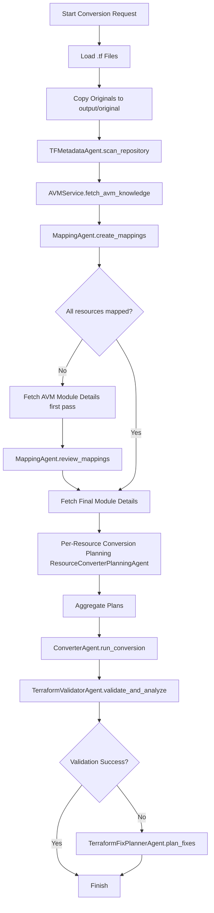
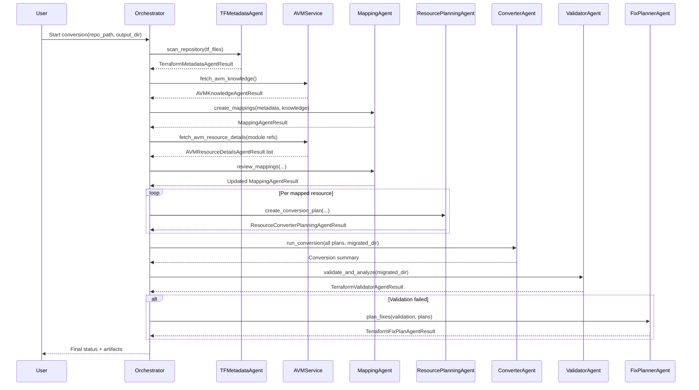

# Terraform to AVM Orchestration Workflow

## Overview
Sequential agent-driven conversion of a Terraform repository to Azure Verified Modules (AVM) with validation and optional fix planning.

## High-Level Steps
1. Copy original .tf files to output/original.
2. Scan repository (TFMetadataAgent).
3. Load AVM knowledge base (AVMService).
4. Generate initial resource-to-module mappings (MappingAgent).
5. Fetch AVM module details (AVMService).
6. (Optional) Refine mappings with module details (MappingAgent.review).
7. Plan conversion per resource (ResourceConverterPlanningAgent).
8. Generate migrated Terraform (ConverterAgent).
9. Validate migrated configuration (TerraformValidatorAgent).
10. Plan fixes if validation failed (TerraformFixPlannerAgent).

---

## Agents and Data Flow

### 1. TFMetadataAgent
- Method: `scan_repository(tf_files)`
- Input:
  - `tf_files`: Dict[str, str] (relative path -> file content)
- Output: `TerraformMetadataAgentResult`
  - Likely includes: `azurerm_resources`, `variables`, `outputs`, `providers`, `modules`
- Persisted: `01_tf_metadata.json`

### 2. AVM Knowledge Retrieval
- Service: `AVMService.fetch_avm_knowledge(use_cache=True)`
- Output: `AVMKnowledgeAgentResult`
  - Contains AVM modules catalog and metadata.
- Persisted: `02_avm_knowledge.json`

### 3. MappingAgent (Initial Mapping)
- Method: `create_mappings(tf_metadata_agent_output, knowledge_result)`
- Input:
  - Terraform metadata (resources, attributes)
  - AVM knowledge (module definitions)
- Output: `MappingAgentResult`
  - `mappings`: list of per-resource mapping decisions (source resource -> target_module or None)
- Persisted: `03_mappings.json`

### 4. AVM Module Details Fetch
- Service: `AVMService.fetch_avm_resource_details(module_name, module_version)`
- Input:
  - Target module name/version from valid mappings
- Output: `AVMResourceDetailsAgentResult` (list)
  - Includes module variables, outputs, examples, patterns.
- Persisted: `04_avm_modules_details.json` (first pass)
- Optional refinement:
  - `MappingAgent.review_mappings(tf_metadata, knowledge, previous_mapping_result, modules_details)`
  - Persisted: `04_01_retry_mappings.json`
- Final module details persisted: `05_avm_modules_details_final.json`

### 5. ResourceConverterPlanningAgent
- Method: `create_conversion_plan(avm_module_detail, resource_mapping, tf_file, original_tf_resource_output_paramers)`
- Input:
  - Single mapping
  - Matched AVM module detail (if any)
  - Original Terraform file tuple `(filename, content)`
  - Referenced outputs used by resource
- Output: `ResourceConverterPlanningAgentResult`
  - Includes: normalized inputs, variable mapping, output mapping, `planning_summary`
- Persisted per resource: `06_<type>_<name>_conversion_plan.json`
- Aggregated summary: concatenated plans passed to next agent.

### 6. ConverterAgent
- Method: `run_conversion(resource_conversion_plan_json_concat, migrated_output_dir, tf_files)`
- Input:
  - All resource conversion plan JSON strings combined
  - Original file dictionary
  - Target migrated folder path
- Output: Conversion summary (Markdown/text)
- Writes migrated Terraform files under `migrated/`
- Persisted summary: `06_conversion_summary.md`

### 7. TerraformValidatorAgent
- Method: `validate_and_analyze(migrated_directory_path)`
- Input: Path to migrated Terraform
- Output: `TerraformValidatorAgentResult`
  - `validation_success: bool`
  - `errors`: structured list
  - `warnings`
  - `recommendations`
- Persisted: `07_terraform_validation.json`

### 8. TerraformFixPlannerAgent (conditional)
- Trigger: Runs only if `validation_success == False`
- Method: `plan_fixes(validation_result, directory, conversion_plans)`
- Input:
  - Validator result
  - Migrated directory
  - Original per-resource planning results
- Output: `TerraformFixPlanAgentResult`
  - `fix_actions`
  - `total_fixable_errors`
  - `total_manual_review_required`
  - `critical_issues`
- Persisted: `08_fix_plan.json`

---

## Mermaid Flow Diagram (Process)

## Mermaid Sequence Diagram (Agent Interaction)

---

## Mermaid Data Flow / Artifact Diagram

```mermaid
flowchart LR
    subgraph Source
        S1[Terraform Repo .tf Files]
    end
    S1 --> A1[TFMetadataAgent]
  A1 -->|01_tf_metadata.json TerraformMetadataAgentResult| M1[MappingAgent]
  M1 -->|03_mappings.json MappingAgentResult| D{Unmapped?}
    D -->|Yes| MD1[Fetch Module Details pass 1]
    MD1 -->|04_avm_modules_details.json| RV[MappingAgent.review_mappings]
    RV -->|04_01_retry_mappings.json| MD2[Fetch Final Module Details]
    D -->|No| MD2[Fetch Final Module Details]
    MD2 -->|05_avm_modules_details_final.json| P1[ResourceConverterPlanningAgent loop]
  P1 -->|06_*_conversion_plan.json Plans Aggregated| C1[ConverterAgent]
  C1 -->|Migrated .tf migrated/ 06_conversion_summary.md| V1[TerraformValidatorAgent]
    V1 -->|07_terraform_validation.json| J{Validation OK?}
    J -->|Yes| END[(Finish)]
    J -->|No| F1[TerraformFixPlannerAgent]
    F1 -->|08_fix_plan.json| END[(Finish)]
    subgraph AVM Knowledge
        K1[AVMService.fetch_avm_knowledge]
    end
  K1 -->|02_avm_knowledge.json AVMKnowledgeAgentResult| M1
    K1 --> MD1
    K1 --> MD2
```

---

## Generated Artifacts (File Naming)
- 01_tf_metadata.json
- 02_avm_knowledge.json
- 03_mappings.json
- 04_avm_modules_details.json
- 04_01_retry_mappings.json (conditional)
- 05_avm_modules_details_final.json
- 06_<resource>_conversion_plan.json (multiple)
- 06_conversion_summary.md
- migrated/ (directory with new Terraform)
- 07_terraform_validation.json
- 08_fix_plan.json (conditional)

## Key Conditional Points
- Remapping only if unmapped resources exist after initial mapping.
- Fix planning only if validation fails.

## Data Reuse
- Terraform metadata reused across mapping and planning.
- Module details reused for multiple resources mapped to same AVM module.
- Planning results reused during fix planning.

## Termination
Process ends after successful validation or after fix plan generation.