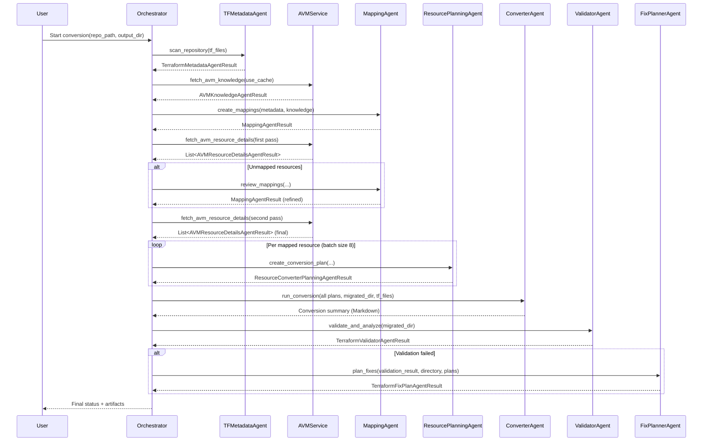

# Terraform to AVM Orchestration Workflow

## Overview
Sequential agent-driven conversion of a Terraform repository to Azure Verified Modules (AVM) with validation and optional fix planning. This document reflects the **current implementation in `main.py`**, including a few intentional (and some accidental) divergences from the original design.

## High-Level Steps (Implementation Order)
1. Copy original `.tf` files to `output/original/` (current implementation flattens structure: all files copied by filename only, losing subdirectory hierarchy).
2. Step 1 (logged): Scan repository (`TFMetadataAgent.scan_repository`).
3. Step 2 (logged): Load AVM knowledge base (`AVMService.fetch_avm_knowledge`).
4. Step 3 (logged): Generate initial resource-to-module mappings (`MappingAgent.create_mappings`).
5. Step 4 (logged): Fetch AVM module details (first pass) for mapped resources → `04_avm_modules_details.json`.
6. Conditional: If any resources unmapped, run `MappingAgent.review_mappings` → `04_01_mappings_after_review.json` (note: filename differs from earlier design which used `04_01_retry_mappings.json`).
7. Fetch AVM module details again (second pass, unconditional) for all (re)validated mappings → `05_avm_modules_details_final.json` (duplicate logic re-runs fetch even for previously retrieved modules; caching mitigates cost).
8. Step 6 (logged): Per-resource conversion planning (`ResourceConverterPlanningAgent.create_conversion_plan`) executed in **async batches of 8**; each plan persisted as `06_<type>_<name>_conversion_plan.json`.
9. Still Step 6 (logged again – numbering duplication): Generate migrated Terraform (`ConverterAgent.run_conversion`) → writes files under `migrated/` and summary `06_conversion_summary.md`.
10. Step 7 (logged): Validate migrated configuration (`TerraformValidatorAgent.validate_and_analyze`) → `07_terraform_validation.json`.
11. Step 8 (logged, conditional): Plan fixes if validation failed (`TerraformFixPlannerAgent.plan_fixes`) → `08_fix_plan.json`.
12. Finish.

### Not Yet Implemented / Design Drift
* Interactive approval gate after planning (mentioned in docstring) is **not present** in current `main.py`.
* Original directory structure preservation is not implemented when copying to `original/`.
* Dual "Step 6" labels in logs (planning + conversion) are a cosmetic inconsistency.
* Module details fetch occurs twice with full regeneration of the list.

---

## Agents and Data Flow

### 1. TFMetadataAgent
- Method: `scan_repository(tf_files)`
- Input:
  - `tf_files`: Dict[str, str] (relative path -> file content)
- Output: `TerraformMetadataAgentResult`
  - Likely includes: `azurerm_resources`, `variables`, `outputs`, `providers`, `modules`
- Persisted: `01_tf_metadata.json`

### 2. AVM Knowledge Retrieval
- Service: `AVMService.fetch_avm_knowledge(use_cache=True)`
- Output: `AVMKnowledgeAgentResult`
  - Contains AVM modules catalog and metadata.
- Persisted: `02_avm_knowledge.json`

### 3. MappingAgent (Initial Mapping)
- Method: `create_mappings(tf_metadata_agent_output, knowledge_result)`
- Input:
  - Terraform metadata (resources, attributes)
  - AVM knowledge (module definitions)
- Output: `MappingAgentResult`
  - `mappings`: list of per-resource mapping decisions (source resource -> target_module or None)
- Persisted: `03_mappings.json`

### 4. AVM Module Details Fetch (First Pass)
- Service: `AVMService.fetch_avm_resource_details(module_name, module_version)`
- Input:
  - Target module name/version from valid mappings
- Output: `AVMResourceDetailsAgentResult` (list)
  - Includes module variables, outputs, examples, patterns.
- Persisted: `04_avm_modules_details.json` (first pass)
#### 4.1 Mapping Review (Conditional)
If unmapped resources remain:
* `MappingAgent.review_mappings(...)` produces refined result.
* Persisted: `04_01_mappings_after_review.json` (current filename).

### 5. AVM Module Details Fetch (Second Pass)
All (re)validated mappings processed again to build a fresh list of module details.
Persisted: `05_avm_modules_details_final.json`.

### 6. ResourceConverterPlanningAgent (Logged as Step 6)
- Method: `create_conversion_plan(avm_module_detail, resource_mapping, tf_file, original_tf_resource_output_paramers)`
- Input:
  - Single mapping
  - Matched AVM module detail (if any)
  - Original Terraform file tuple `(filename, content)`
  - Referenced outputs used by resource
- Output: `ResourceConverterPlanningAgentResult`
  - Includes: normalized inputs, variable mapping, output mapping, `planning_summary`
- Persisted per resource: `06_<type>_<name>_conversion_plan.json`
- Aggregated summary: concatenated plans passed to next agent.

### 6 (again). ConverterAgent (Also Logged as Step 6)
- Method: `run_conversion(resource_conversion_plan_json_concat, migrated_output_dir, tf_files)`
- Input:
  - All resource conversion plan JSON strings combined
  - Original file dictionary
  - Target migrated folder path
- Output: Conversion summary (Markdown/text)
- Writes migrated Terraform files under `migrated/`
- Persisted summary: `06_conversion_summary.md`

### 7. TerraformValidatorAgent (Logged as Step 7)
- Method: `validate_and_analyze(migrated_directory_path)`
- Input: Path to migrated Terraform
- Output: `TerraformValidatorAgentResult`
  - `validation_success: bool`
  - `errors`: structured list
  - `warnings`
  - `recommendations`
- Persisted: `07_terraform_validation.json`

### 8. TerraformFixPlannerAgent (Conditional, Logged as Step 8)
- Trigger: Runs only if `validation_success == False`
- Method: `plan_fixes(validation_result, directory, conversion_plans)`
- Input:
  - Validator result
  - Migrated directory
  - Original per-resource planning results
- Output: `TerraformFixPlanAgentResult`
  - `fix_actions`
  - `total_fixable_errors`
  - `total_manual_review_required`
  - `critical_issues`
- Persisted: `08_fix_plan.json`

---

## Mermaid Flow Diagram (Process)

```mermaid
flowchart TD
    A[Start Conversion Request] --> B[Load .tf Files]
    B --> C[Copy Originals (flatten) to output/original]
    C --> D[Step 1: TFMetadataAgent.scan_repository]
    D --> E[Step 2: AVMService.fetch_avm_knowledge]
    E --> F[Step 3: MappingAgent.create_mappings]
    F --> G[Step 4: Fetch Module Details (pass 1)]
    G --> H{Unmapped resources?}
    H -->|Yes| I[Review Mappings -> 04_01_mappings_after_review.json]
    H -->|No| J[Skip Review]
    I --> K[Step 4b: Fetch Module Details (final pass)]
    J --> K[Fetch Module Details (final pass)]
    K --> L[Step 6a: Per-Resource Planning (batch async, size=8)]
    L --> M[Step 6b: ConverterAgent.run_conversion]
    M --> N[Step 7: TerraformValidatorAgent]
    N --> O{Validation success?}
    O -->|Yes| P[Finish]
    O -->|No| Q[Step 8: TerraformFixPlannerAgent]
    Q --> P[Finish]
```

## Mermaid Sequence Diagram (Agent Interaction)

```mermaid
sequenceDiagram
  participant User
  participant Orchestrator
  participant TFMetadataAgent
  participant AVMService
  participant MappingAgent
  participant ResourcePlanningAgent
  participant ConverterAgent
  participant ValidatorAgent
  participant FixPlannerAgent

  User->>Orchestrator: Start conversion(repo_path, output_dir)
  Orchestrator->>TFMetadataAgent: scan_repository(tf_files)
  TFMetadataAgent-->>Orchestrator: TerraformMetadataAgentResult
  Orchestrator->>AVMService: fetch_avm_knowledge(use_cache)
  AVMService-->>Orchestrator: AVMKnowledgeAgentResult
  Orchestrator->>MappingAgent: create_mappings(metadata, knowledge)
  MappingAgent-->>Orchestrator: MappingAgentResult
  Orchestrator->>AVMService: fetch_avm_resource_details(first pass)
  AVMService-->>Orchestrator: List<AVMResourceDetailsAgentResult>
  alt Unmapped resources
    Orchestrator->>MappingAgent: review_mappings(...)
    MappingAgent-->>Orchestrator: MappingAgentResult (refined)
  end
  Orchestrator->>AVMService: fetch_avm_resource_details(second pass)
  AVMService-->>Orchestrator: List<AVMResourceDetailsAgentResult> (final)
  loop Per mapped resource (batch size 8)
    Orchestrator->>ResourcePlanningAgent: create_conversion_plan(...)
    ResourcePlanningAgent-->>Orchestrator: ResourceConverterPlanningAgentResult
  end
  Orchestrator->>ConverterAgent: run_conversion(all plans, migrated_dir, tf_files)
  ConverterAgent-->>Orchestrator: Conversion summary (Markdown)
  Orchestrator->>ValidatorAgent: validate_and_analyze(migrated_dir)
  ValidatorAgent-->>Orchestrator: TerraformValidatorAgentResult
  alt Validation failed
    Orchestrator->>FixPlannerAgent: plan_fixes(validation_result, directory, plans)
    FixPlannerAgent-->>Orchestrator: TerraformFixPlanAgentResult
  end
  Orchestrator-->>User: Final status + artifacts
```

---

## Mermaid Data Flow / Artifact Diagram

```mermaid
flowchart LR
    subgraph Source
        S1[Terraform Repo .tf Files]
    end
    S1 --> A1[TFMetadataAgent]
    A1 -->|01_tf_metadata.json| M1[MappingAgent]
    M1 -->|03_mappings.json| D{Unmapped?}
    D -->|Yes| MD1[Fetch Module Details Pass 1]
    MD1 -->|04_avm_modules_details.json| RV[MappingAgent.review_mappings]
    RV -->|04_01_mappings_after_review.json| MD2[Fetch Module Details Pass 2]
    D -->|No| MD2[Fetch Module Details Pass 2]
    MD2 -->|05_avm_modules_details_final.json| P1[Per-Resource Planning (batch)]
    P1 -->|06_*_conversion_plan.json| C1[ConverterAgent]
    C1 -->|06_conversion_summary.md + migrated/| V1[ValidatorAgent]
    V1 -->|07_terraform_validation.json| J{Validation OK?}
    J -->|Yes| END[(Finish)]
    J -->|No| F1[FixPlanner]
    F1 -->|08_fix_plan.json| END[(Finish)]
    subgraph AVM Knowledge
        K1[AVMService.fetch_avm_knowledge]
    end
    K1 -->|02_avm_knowledge.json| M1
    K1 --> MD1
    K1 --> MD2
```

---

## Generated Artifacts (Current File Naming)
Mandatory unless noted:
* `01_tf_metadata.json`
* `02_avm_knowledge.json`
* `03_mappings.json`
* `04_avm_modules_details.json`
* `04_01_mappings_after_review.json` (conditional)
* `05_avm_modules_details_final.json`
* `06_<type>_<name>_conversion_plan.json` (multiple)
* `06_conversion_summary.md`
* `migrated/` (directory with converted Terraform code)
* `07_terraform_validation.json`
* `08_fix_plan.json` (conditional)

## Implementation Nuances & Notes
| Aspect | Current Behavior | Potential Improvement |
|--------|------------------|-----------------------|
| Original file copy | Flattens into `output/original/` | Preserve relative paths to avoid name collisions |
| Module details fetch | Two passes (first + second) | Consolidate into single conditional pass |
| Step numbering | Duplicate "Step 6" in logs | Renumber conversion step to "Step 7" pre-validation |
| Interactive approval | Not implemented | Add pause after planning for user confirmation |
| Async planning | Batched with `batch_size=8` | Make batch size configurable via settings |
| File naming mismatch | Uses `04_01_mappings_after_review.json` | Align documentation & code (done here) |
| Error logging | Full JSON dumped to log & file | Optionally truncate very large payloads |

## Suggested Next Refinements (Non-functional)
1. Introduce an approval gate before running the converter (align with docstring promise).
2. Preserve folder structure in `original/` by recreating relative paths.
3. Adjust step logging numbers to eliminate duplicates.
4. Avoid redundant second module detail fetch when review did not occur.
5. Expose batch size via configuration (`settings`).

---
This document now mirrors the actual sequence implemented in `main.py`. Revisit after any orchestrator refactor to keep it authoritative.

## Key Conditional Points
- Remapping only if unmapped resources exist after initial mapping.
- Fix planning only if validation fails.

## Data Reuse
- Terraform metadata reused across mapping and planning.
- Module details reused for multiple resources mapped to same AVM module.
- Planning results reused during fix planning.

## Termination
Process ends after successful validation or after fix plan generation.