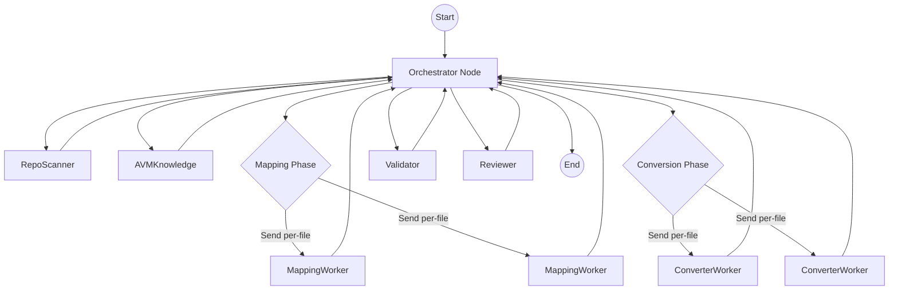

Below is a **high-level technical specification** (in Markdown) for implementing your multi-agent Terraform → AVM migration system using **LangGraph**. It is a first, minimal version. It uses Python, follows GenAI best practices (e.g. Pydantic for schemas), and leans on LangGraph’s workflow/agent abstractions (incl. orchestrator-worker model) per their documentation (e.g. orchestrator patterns) ([LangChain][1]).

---

# Technical Spec: LangGraph-based Multi-Agent AVM Migration System

## 1. Architecture & Design Goals

* Use **LangGraph** to build a workflow graph with an **Orchestrator** plus specialized **worker agents** (scanning, mapping, conversion, validation, review).
* Keep versioning and structured outputs via **Pydantic models**.
* Support **human-in-the-loop** approval steps via LangGraph’s persistence / gating (pause + resume) features. ([LangChain][1])
* Provide **observability**, logs, and simple retry semantics.
* Use Python idioms, dependency injection, modular design, testability.

---

## 2. Key Components & Modules

* `agents/` — module containing each agent’s logic (RepoScanner, AVMKnowledge, Mapping, Converter, Validator, Reviewer)
* `schemas/` — Pydantic schemas for inputs/outputs between agents
* `orchestrator/` — LangGraph workflow definition wiring agents
* `tools/` — utility functions (HCL parsing, Git operations, Terraform CLI wrappers)
* `config/` — config, constants, AVM index endpoints, logging setup
* `main.py` (or `run_workflow.py`) — entrypoint to trigger migration workflow

---

## 3. Data Schemas (Pydantic)

Example schemas to define:

```python
from pydantic import BaseModel
from typing import List, Optional

class RepoInput(BaseModel):
    repo_folder: str  # local path or remote identifier

class FileManifest(BaseModel):
    path: str
    resources: List[dict]  # e.g. {"type": str, "name": str}

class RepoManifest(BaseModel):
    files: List[FileManifest]
    variables: List[dict]
    outputs: List[dict]
    providers: List[str]
    terraform_version: Optional[str]

class AVMIndexEntry(BaseModel):
    resource_type: str
    avm_module: str
    version: str

class AVMIndex(BaseModel):
    entries: List[AVMIndexEntry]

class MappingEntry(BaseModel):
    original: str
    mapped_to: Optional[str]
    confidence: float

class MappingResult(BaseModel):
    mappings: List[MappingEntry]
    unmapped: List[str]

class ConversionResult(BaseModel):
    converted_repo_path: str
    files_converted: List[str]

class ValidationErrorItem(BaseModel):
    tool: str
    message: str

class ValidationResult(BaseModel):
    status: str  # "success" or "failed"
    errors: List[ValidationErrorItem]
    warnings: List[str]

class ReviewReport(BaseModel):
    markdown: str
```

These schemas will be the interface between agents and ensure type safety / clarity.

---

## 4. LangGraph Workflow / Orchestration

### 4.1 Orchestrator-Worker Model (LangGraph)

* The Orchestrator node produces a plan and then **sends tasks** to workers; workers write results to a shared key.
* After workers finish, the orchestrator synthesizes final outputs.


### 4.2 Human-in-the-Loop Gates

* In the Review phase, if certain confidence thresholds fail or high-risk flags exist, pause workflow and present the report for human review before finalizing.
* Use LangGraph persistence / gating to suspend and resume workflow. ([LangChain][1])

---

## 5. Agents’ Responsibilities (High Level)

| Agent        | Responsibility                                 
| ------------ | ---------------------------------------------- 
| RepoScanner  | Clone repo, parse HCL, build manifest          
| AVMKnowledge | Fetch AVM index, docs                          
| Mapping      | For each resource/file, propose mapping to AVM 
| Converter    | Rewrite `.tf` files using mappings             
| Validator    | Run validation + lint on converted repo        
| Reviewer     | Generate final report / human review gate      

* Agents must accept and return data in the Pydantic schema forms.

---

## 6. Workflow Sketch (Mermaid-style in MD)



* The **Orchestrator** node dynamically uses `Send` for mapping & conversion workers, then collects results and sequences the rest.

---

## 7. Execution Flow (Step by Step)

1. **Entry**: node `orchestrator` invoked with `RepoInput`.
2. **RepoScanner**: called by orchestrator, outputs `RepoManifest`.
3. **AVMKnowledge**: invoked with query on resource types, yields `AVMIndex`.
4. **Mapping Phase**: orchestrator sends **per-file mapping jobs** to `MappingWorker` tasks, aggregate into `MappingResult`.
5. **Conversion Phase**: orchestrator sends **per-file conversion jobs** to `ConverterWorker` tasks, producing `ConversionResult`.
6. **Validation**: run global validation (Terraform validate, lint) on converted repo.
7. **Review & Gate**: produce `ReviewReport`. If critical issues, pause for human approval.
8. **Return final outcome**: either path to converted repo or report.

---

## 8. Development Best Practices & Notes

* Use **dependency injection** (e.g. pass tools, config into agents) so logic is testable.
* Agents should be small, single-purpose functions (or `@task` nodes).
* Log structured entries (JSON) at each agent step for observability.
* Validate Pydantic models at the boundaries between agents.
* Provide fallback behavior / graceful error handling (timeouts, retries).

## 9. Python Dependencies & `requirements.txt`

The project uses a Python environment (>=3.10 recommended) with the following core dependencies. A generated `requirements.txt` should live at the repository root and be kept in sync when new libraries are introduced. Where possible, versions are pinned with compatible-release operators (`~=`) to balance stability and updates.

### External (Non-Python) Tooling Prerequisites

The following executables must be available on the PATH for the Validator agent:

* Terraform CLI (>=1.6)
* `tflint`
* `checkov`

These are intentionally not inside `requirements.txt` because they are installed via native package managers (e.g., `choco`, `brew`, `apt`) or their own installers.

### Dependency Management Notes

* For local iterative development, you may optionally adopt `uv` or `pip-tools` for lockfile generation; this is out-of-scope for the initial minimal spec.
* If GPU or alternative inference backends are introduced later (e.g., local models), add conditional extras (e.g., `transformers`, `accelerate`).
* Keep import usage minimal inside agents to make unit testing easier (allowing selective dependency injection / mocking).

---

## 10. Testing Strategy & Structure

### 10.1 Goals

Provide fast feedback (unit-level) and confidence (end-to-end) that the sequential migration workflow behaves as expected while we still rely on stubbed agent outputs. The testing strategy is intentionally layered so real parsing / validation logic can be introduced without rewriting the suite.

### 10.2 Test Pyramid (Current Stage)

| Layer | Purpose | Examples |
|-------|---------|----------|
| Unit | Individual agent stub returns deterministic schema-compliant data | `tests/test_agent_stubs.py` |
| Workflow (Smoke) | End-to-end orchestration sanity (no fixtures) | `tests/test_workflow_smoke.py` |
| End-to-End (Fixture) | Realistic repo fixture drives full flow, validates artifacts | `tests/test_e2e_fixture_repo_basic.py` |

### 10.3 Directory Layout

```
tests/
    fixtures/
        repo_basic/
            main.tf
            network.tf
            variables.tf
            outputs.tf
    test_agent_stubs.py
    test_workflow_smoke.py
    test_e2e_fixture_repo_basic.py
```

### 10.4 Fixture: `repo_basic`

Represents the canonical minimal Terraform repository used for the E2E test. Files mirror the functional specification resources (vnet + subnet) to keep assertions aligned with the stub outputs.

| File | Purpose |
|------|---------|
| `main.tf` | Defines `azurerm_virtual_network` resource |
| `network.tf` | Defines `azurerm_subnet` resource |
| `variables.tf` | Provides `location` variable |
| `outputs.tf` | Exposes `vnet_id` output |

### 10.5 E2E Test Assertions

The end-to-end test (`test_e2e_fixture_repo_basic.py`) verifies:

1. Workflow returns a `FinalOutcome` with `status == "failed"` (current validator stub behavior).
2. A markdown report is generated under `./output/reports/`.
3. Report contains required sections and mappings:
     * `# Conversion Report: repo1`
     * `## ✅ Converted Files`
     * `## ⚠️ Issues Found`
     * Lines referencing `azurerm_virtual_network` and `avm-res-network-virtualnetwork`.
     * Error line: `Missing required variable 'dns_servers'`.
4. Converted placeholder files are written to `./output/repo1_avm/` with the four expected filenames.
5. Converted files begin with the text header `// Converted placeholder`.
6. Idempotency: a second invocation with the same fixture yields the same `status`.

### 10.6 Idempotency & Isolation

Tests clean any pre-existing `./output` directory (where appropriate) to avoid false positives. The E2E test uses only the committed fixture—no network, cloning, or external Terraform tooling required at this stage.

### 10.7 Adding Future Scenarios (Planned)

| Scenario | Fixture Folder | Purpose |
|----------|----------------|---------|
| Unmapped resource | `repo_unmapped` | Validate population of `unmapped` list |
| Empty repo | `repo_empty` | Scanner edge case handling |
| Success path | Re-use `repo_basic` + env flag | Exercise validator success branch |
| Complex dependencies | `repo_complex_network` | Test future graph-based dependency extraction |

### 10.8 Execution Instructions

Install dependencies (includes `pytest`) and run tests:

```bash
pip install -r requirements.txt
pytest -q
```

Run a single test file:
```bash
pytest tests/test_e2e_fixture_repo_basic.py -q
```

Show detailed output:
```bash
pytest -vv
```

Optional (future) markers (e.g., when CLI or integration tests are added):
```bash
pytest -m e2e
```

### 10.9 Logging During Tests

`structlog` emits JSON by default. To switch to a human-readable console renderer during local test runs:

```bash
LOG_LEVEL=INFO TRACE=0 pytest -q
```

### 10.10 Quality Gates (Initial Phase)

Currently enforced implicitly by the suite:

| Gate | Mechanism |
|------|-----------|
| Schema integrity | Pydantic model instantiation in agents/tests |
| Basic orchestration correctness | Smoke + E2E workflow tests |
| Artifact generation | Assertions on report + converted files |
| Determinism | Idempotency re-run assertion |

Future additions may include type checking (mypy), linting (ruff), and security scanning (bandit / checkov integration) once real validation is implemented.

### 10.11 Test Evolution Policy

As stub logic is replaced:
* Keep existing assertions as a baseline; widen (not remove) checks when outputs become richer.
* Introduce parametrization instead of hard-coded status assertions when validator can both pass/fail.
* Add markers (`@pytest.mark.integration`) for tests invoking real Terraform / external tools to keep default suite fast.

---

## 11. Roadmap (Testing-Relevant Highlights)

| Milestone | Testing Impact |
|-----------|----------------|
| Real HCL parsing | Add assertions for resource count from actual parse |
| Live AVM index retrieval | Mock HTTP layer + add failure injection test |
| Terraform CLI validation | Add integration test with local Terraform binary detection |
| Human-in-the-loop gating | Simulate paused state & resume test |
| Parallelization (later) | Ensure deterministic aggregation order or adjust tests to be order-agnostic |

---

*Document updated to include comprehensive test structure and execution guidance.*
